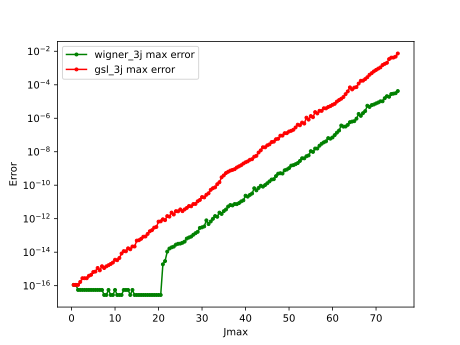
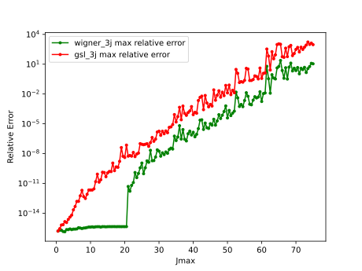
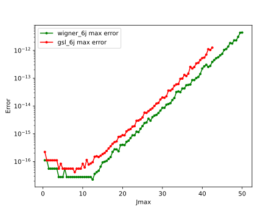
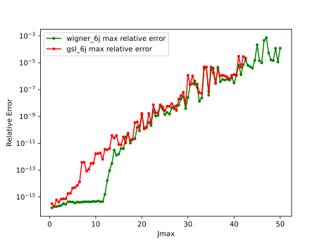
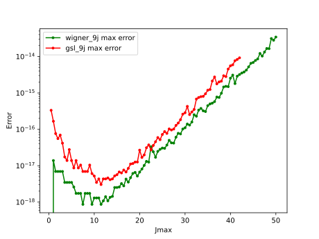
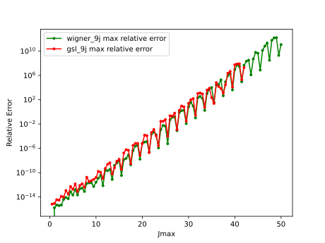

# wigner-benchmark

Benchmark my [WignerSymbol](https://github.com/0382/WignerSymbol) library and `GNU-GSL` library's `gsl_sf_coupling_?j` functions.

The error is evaluated using [wigxjpf](https://fy.chalmers.se/subatom/wigxjpf/) library, which can evaluate  Wigner 3j, 6j and 9j symbols accurately using prime factorisation and multi-word integer arithmetic.

All of the following calculations include half integer arguments.

## Error

See `src/error.cpp` for details.

### 3j

### 6j

The `gsl_sf_coupling_6j` will throw error because `gamma` function overflow at `Jmax == 43`.

### 9j

Because the 9j calculation is too slow, the error statistics are only performed on part of the possible arguments. See `src/error.cpp` for details. So the following results are not guaranteed to cover the exact max error.

## Performance

See `src/bench.cpp` for details.

### 3j

Calculate all possible Wigner 3j symbol up to Jmax.

|        Jmax        |  10   |  15   |  20   |  25   |  30   |
| :----------------: | :---: | :---: | :---: | :---: | :---: |
|   wigner_3j(my)    | <1ms  |  6ms  | 20ms  | 64ms  | 144ms |
| gsl_sf_coupling_3j | 14ms  | 103ms | 446ms | 1.52s | 4.26s |
|  wig3jj(wigxjpf)   |  8ms  | 77ms  | 422ms | 1.55s | 4.72s |

### 6j

Calculate all possible Wigner 6j symbol up to Jmax. 

|        Jmax        |  10   |  15   |  20   |  25   |  30   |
| :----------------: | :---: | :---: | :---: | :---: | :---: |
|   wigner_6j(my)    |  7ms  | 75ms  | 327ms | 1.48s | 3.97s |
| gsl_sf_coupling_6j | 41ms  | 455ms | 2.43s | 9.84s | 32.4s |
|  wig6jj(wigxjpf)   | 82ms  | 1.01s | 6.90s | 32.1s | 118s  |

### 9j

Calculate all possible Wigner 9j symbol up to Jmax. 

|        Jmax        |   4   |   6   |   8   |  10   |  12   |
| :----------------: | :---: | :---: | :---: | :---: | :---: |
|   wigner_9j(my)    |  8ms  | 219ms | 2.11s | 15.9s | 91.9s |
| gsl_sf_coupling_9j | 125ms | 2.39s | 28.8s | 198s  | 1225s |
|  wig9jj(wigxjpf)   | 78ms  | 2.47s | 31.4s | 276s  | 1977s |
